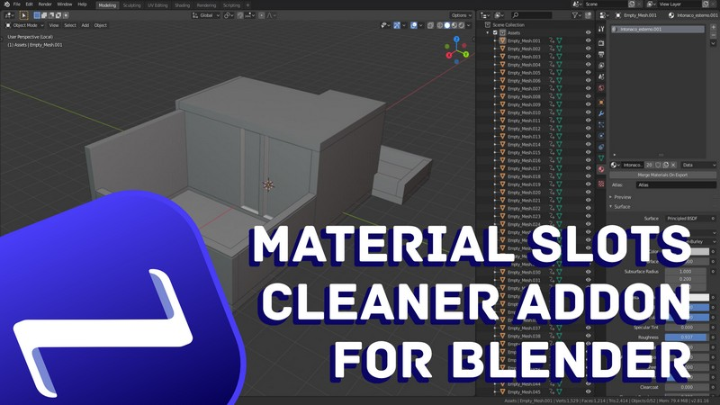

# MatSlotCleaner
## Remove unused material slots from all selected meshes at once in Blender

This simple addon is checking each selected mesh and removing unused material slots that could have been still attached to your meshes.
I found it pretty useful in cases were you have to separate an imported fbx into different pieces. By default all the newly created meshes will inherit all the applied materials of the original fbx, even if the single mesh does not use all of them. With MatSlotCleaner, instead of having to go through each mesh and remove unused slots, you can do it with just one click.
Keep in mind that this addon is not deleting unused materials from your blend file (you can easily already do that in default Blender), but it's cleaning the material slots instead.

### Overview video

---
If you find the content useful, you could get me a coffee at https://www.buymeacoffee.com/nazzareno ☕🤎
For more, you can follow me on Twitter, Youtube, and Instagram  🙏
:globe_with_meridians: For more about what I do, you can visit my [personal website](https://www.nazzarenogiannelli.com/)
